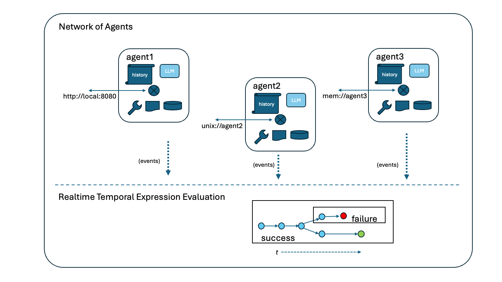
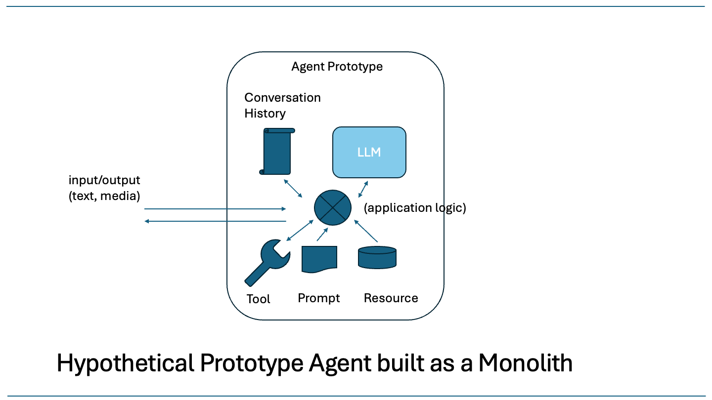

# Checkr Agent Networks

See the following reference for an early version of this work.

- *An Approach to Checking Correctness for Agentic Systems*: https://arxiv.org/abs/2509.20364

## Introduction

This project introduces two new capabilities.

1.  Composable NLIP Agents.  One executable may now consist of multiple agents that communicate amongst themselves to respond to queries.  An "Agent System" is a collection of Agents with a well-defined mechanism for sending messages to each other via a specified "address."  (See the [./checkr_agents/system](./checkr_agents/system) directory.)

2.  Checkr Agents.  The lifecycle of an Agent, and its handling of a query, is defined by a series of events.  These events are emitted to a cooperative thread that is running one or more "assertions."  An assertion can verify the correctness of a temporal expression over time, or otherwise check the correctness of the event trace of an Agent in a non-invasive way.

## Networks of Agents: the System

An NLIP Agent exposes its front-end via an HTTP (or HTTPS) server with a designated endoint (`/nlip`) receiving and sending JSON messages of a specified format (NLIP Message Format).  When deployed, an HTTP server is mounted at an address.  Most often, the address is a "network address" at a specific IP address, or a hostname.  The combination of the `scheme` and the address identify the protocol the server understands and where it is listening.

- `http://10.0.0.20`
- `http://example-host.ai`

This project defines two new mount notations.

- `unix://agent-name`
- `mem://agent-name`

The first is a mount notation that indicates an NLIP Agent server listening at a Unix Domain Socket on the current host.  The second is a mount notation that indicates an NLIP Agent server listening at an in-memory channel.

Mounts agents of of various types may be specified in a simple declarative way and the "System" mount machinery figures out to run the various agents, listening at the different types of addresses.   This means that it is easy to decompose problems into networks of agents, with each specialized for a specific task.  Specialization helps keep agents compact and performant.

The significance of the different types of address is that they have different security profiles.  A network address may be reachable by other computers.  A Unix Domain Socket may be reachable by other processes on the same computer.  Agents mounted at `mem://` URIs are only reachable by the other agents it was launched with.

Coordinator NLIP Agents are agents that have *tools* to send and receive messages to other NLIP Agents via an address.  A `mem://` address is entirely local to an Agent System.  This makes it very useful for the composition of specialized agents into a single system, where only one (the Coordinator) has a network exposed address.

The significance of this scheme is that it universally uses the NLIP Agent as the unit of agent composibility independent of whether the NLIP Agent is exposed on the network, or whether it is one of a collection of cooperatively-multithreaded agents residing in one process.  An NLIP Agent has an address, and it may be public or private, but it behaves the same either way.

## Checkers and Assertions

All agents in this project derive from the base class `CheckrAgent`.  A CheckrAgent emits events at well-defined points in its lifetime.  For example, some of the key events of handling of a query are shown below.

- `on_query_received`
- `on_query_analyzed`
- `on_all_tools_called`
- `on_query_handled`

When launched, an Agent System may start one or more "assertions."  An assertion is a coroutine that verifies a statement of truth about an Agent System.  An assertion may run at a single point in time, or it may consider a sequence of events over time.

