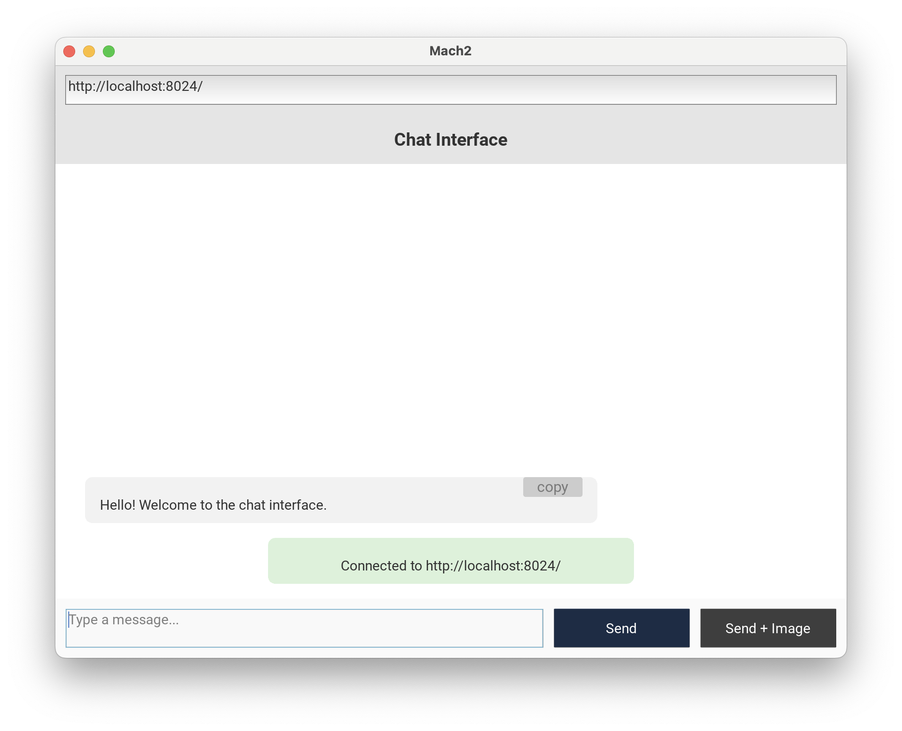
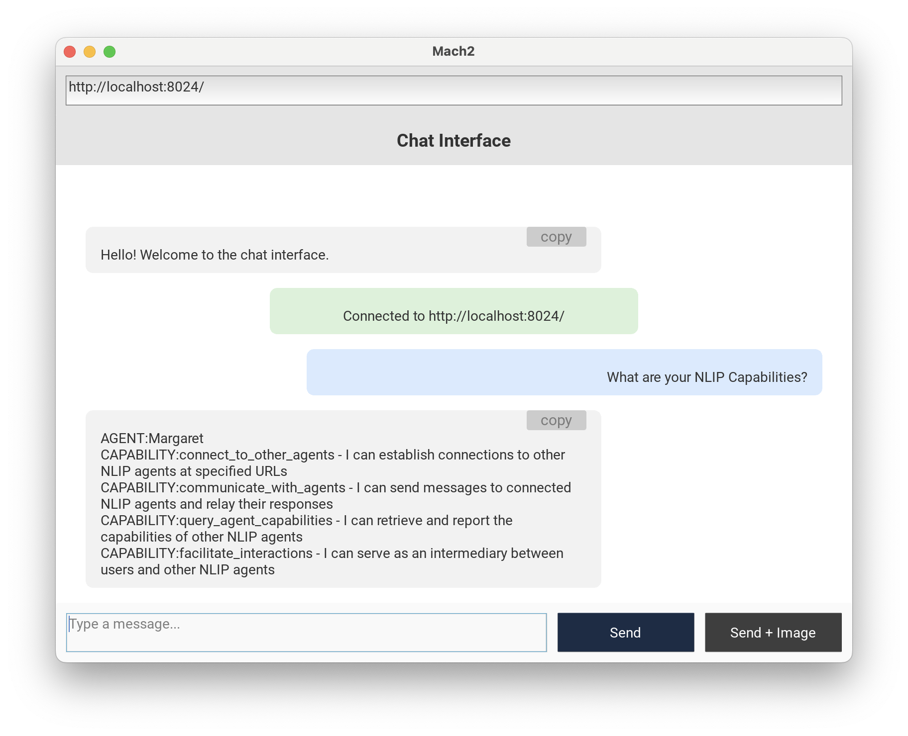
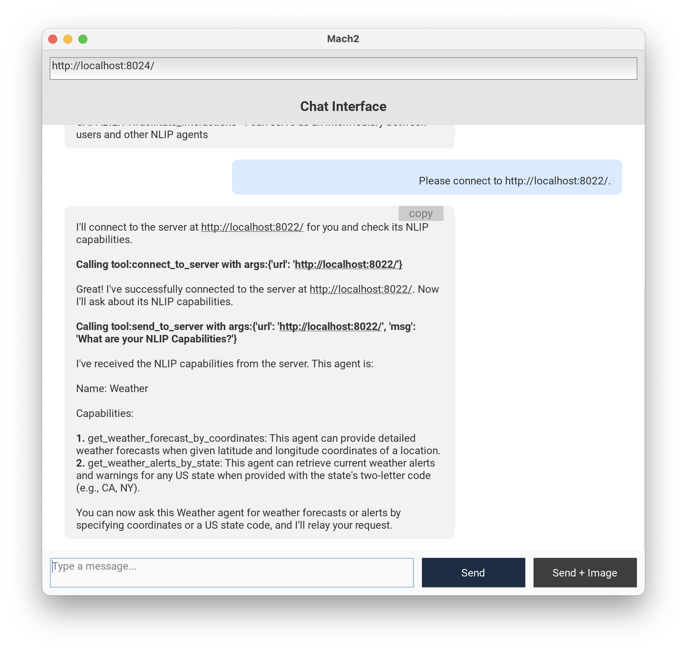
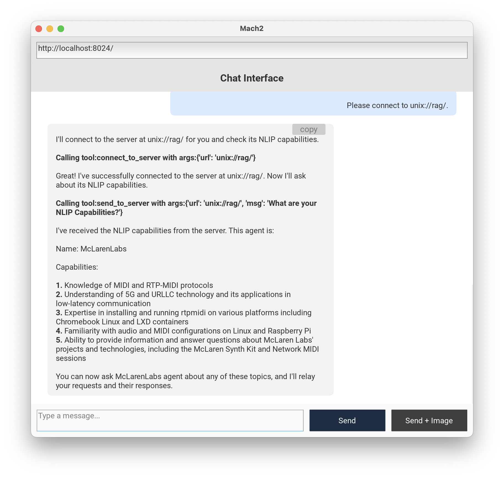
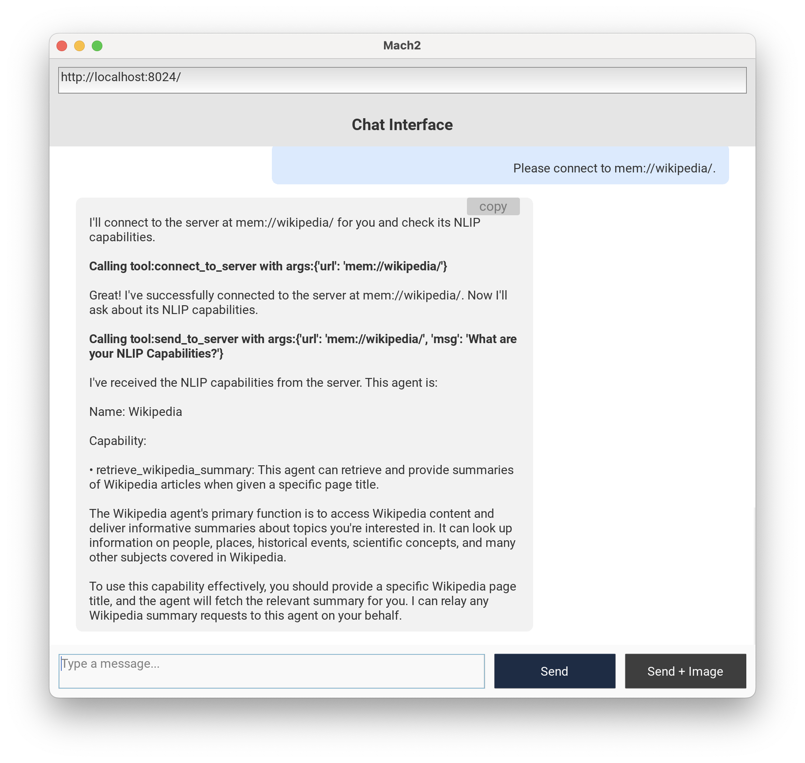
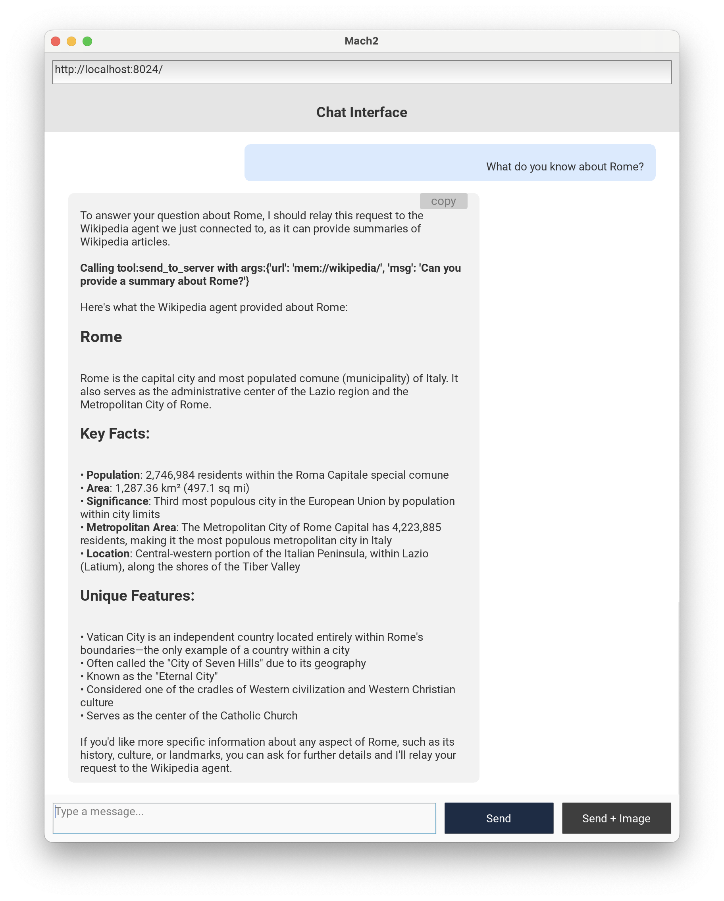
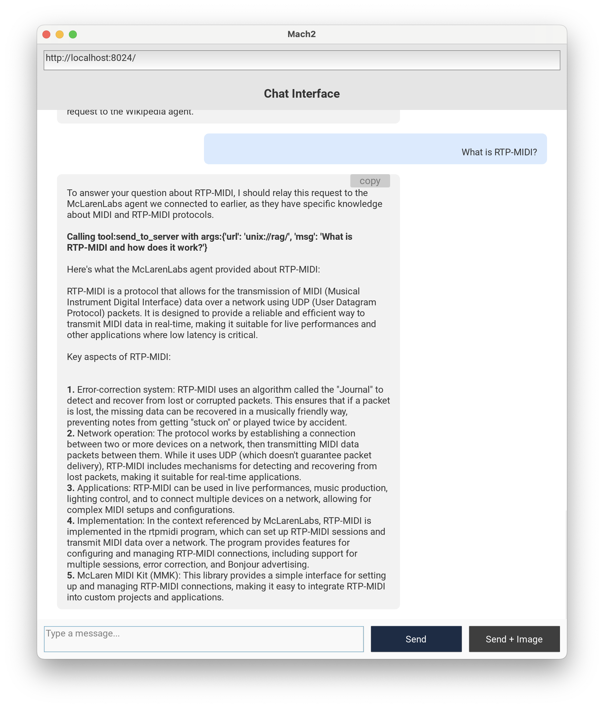
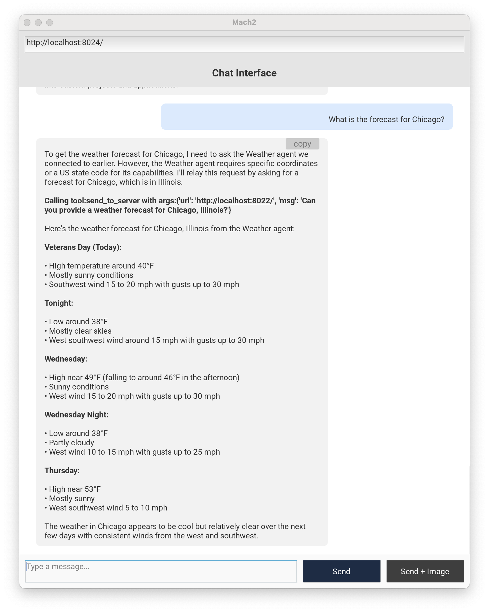
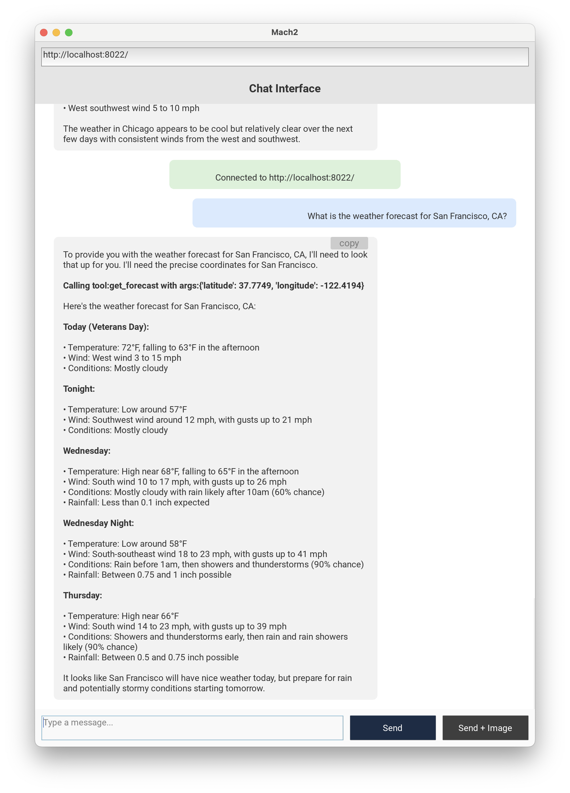
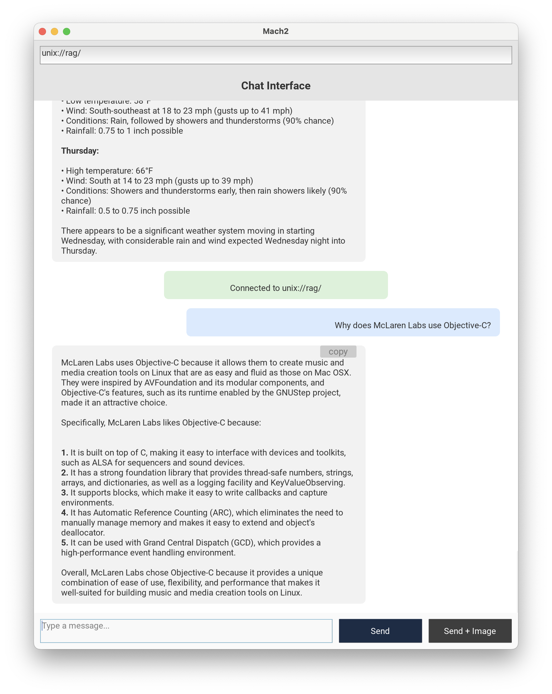

# Table Of Contents

1. [Checkr Agent System Introduction](#checkr-agent-system)

    1.1. [Protection Domains](#protection-domains)

2. [Demonstration and Explanation](#demonstration-and-explanation)

    2.1  [Use Mach2 to Connect to the Coordinator Agent](#use-mach2-to-connect-to-the-coordinator)

    2.2  [Ask the Coordinator about its NLIP Capabilities](#ask-the-coordinator-about-its-nlip-capabilities)

    2.3  [Connect to the Weather Agent](#connect-to-the-weather-agent)

    2.4  [Connect to the RAG Agent](#connect-to-the-rag-agent)

    2.5  [Connect to the Wikipedia Agent](#connect-to-the-wikipedia-agent)

    2.6  [Exercise the Specialized Agents](#exercise-the-specialized-agents)
    
    2.7  [Connect Directly to other Internal Agents](#connect-directly-to-other-internal-agents)


## Checkr Agent System

An Agent Server, as defined in this project, is a FastAPI application server with an NLIP endpoint at a standard URL.
By definition, all NLIP agent servers expose an `/nlip` endpoint, but individual servers can be run at different addresses.  

In this project, an Agent Server address can be a network address, a unix pipe name or a named in-memory channel.

Agent servers can be run as individual processes or can be combined into a multi-agent "system" that is run in a single process.  Such a multi-agent system is described by a "Mount Specification" which lists the collection of agent servers and their addresses.

An example below shows a mount specification example.  In it, three servers are created.  Each of which is a FastAPI server "app" serving an NLIP endpoint for an agent.

``` python

agent_server1 = ...
agent_server2 = ...
agent_server3 = ...

mount_spec = [
  (agent_server1, "http://localhost:8024")
  (agent_server2, "unix://pipename")
  (agent_server3, "mem://channelname")
]

```

- The first line mounts "agent_server1" at the network address "http://localhost:8024".
- The second line mounts "agent_server2" at the Unix Socket Domain named "pipename".  By convention, Agent Server unix sockets are mounted at "/tmp/agent-{pipename}.sock".
- The third line mounts "agent_server3" with the in-memory pipe name "channelname."

The nice thing about the mount names is that they are used consistently across the NLIP Agent Servers in this project.  For example, if using the Mach2 NLIP chat agent, you can connect directly to "http://localhost:8024" to interact with `agent_server1`.

Mach2 also understands the Unix Domain Socket convention of Agent Servers so that if you type "unix://pipename" into the address bar of Mach2, it will find the Unix Domain Socket "/tmp/agent-{pipename}.sock" and open a session there.

In-Memory addresses are slightly different: they exist only within the Unix process of the running servers.  This feature becomes very useful for inter-agent communication using HTTP clients.  For example, in the `CoordinatorNlipAgent` if you type:

``` console
Can you please connect to mem://channelname/.
```

the Coordinator NLIP Agent will use its HTTP client to open a connection to the Agent at the in-memory channel with name "channelname".  Then that second agent will be available for use by the front-end the coordinator agent.

Channel-specifications are a consistent way to facilitate inter-agent communication across NLIP Agent Servers.


### Protection Domains

The three different mount domains (network, unix socket, in-memory channel) have different security characteristics.

- Network addresses may be reachable from other computers on the network.
- Unix Domain Sockets are only reachable by other processes on the same computer.
- In-Memory channels are reachable by other agents in the same process.

These different kinds of mount addresses allow some flexibility in designing multi-agent systems, and give means to restrict access to sensitive agents by keeping them in-memory, or by configuring Unix Sockets with appropriate permissions.


## Demonstration and Explanation

The multi-agent system called "ms4" in this directory is a composition of agents.  We configured their listening addresses as shown below.  Two have public network addresses, one has a unix domain socket, and the last is completey internal to the agent system.

``` python
    mount_spec = [
        (coord,   "http://0.0.0.0:8024/"),
        (weath,   "http://0.0.0.0:8022/"),
        (rag,     "unix://rag/"),
        (wiki,    "mem://wikipedia/"),
    ]
```


### Use Mach2 to connect to the Coordinator

The first thing we will do is use the [Mach2](https://github.com/sheffler/kivy-chat-mach2) "Universal NLIP Client" to connect to the front-end Coordinator Agent of the agent system.  To do this, enter the address `http://localhost:8024/` in the address bar of Mach2 and press return.  You should see a system message in green confirming the connection.




### Ask the Coordinator about its NLIP Capabilities

Now, recall that all of the agents in the system derive from the class `NlipAgent`.  An `NlipAgent` has an instruction that teaches it how to respond to a request to describe its "NLIP Capabilities."  We can try this ourselves to see what's its capabilties are.

From its response, we can see that the agent is named "Margaret" and that it has the capability to connect to other agents!  This is exactly what we expect.  The coordinator agent can use *tools* to connect to other NLIP agents.





### Connect to the Weather Agent

Now let's ask the Coordinator Agent to connect to an agent by its URI.  We know that our system includes a Weather Agent and that it has been configured for `http://0.0.0.0:8022`.  Notice that we have entered "Please connect to http://localhost:8022/" in the chat.

What happens next is interesting.  The Coordinator Agent uses its `connect_to_server()` tool to connect to the remote agent.  Once it connects, the Coordinator Agent then queries to find out the remote agent's "NLIP Capabilities."  It does this by using the `send_to_server()` tool to send the message to the URI.  The Coordinator Agent has been taught this two-step exchange by the instruction given to it.  (See the `NLIP_COORDINATOR_PROMPT` string in `coordinator_nlip_agent.py` for details.)

From the response, we can see that the remote agent is named "Weather" and that it has capabilities to get a weather forecast by coordinators, or to get a weather alert by state abbreviation.  So far so good.

Since this information is recorded in the message history of the Coordinator Agent, it will be able to look up the URI of this remote agent by its name ("Weather") or by its capabilities.

The message history will be used as a content-addressable memory in these cases!




### Connect to the RAG Agent

Now let's dynamically add another agent.  Our agent system has included a RAG agent at the URI `unix://rag/.`  Let's add this by typing "Please connect to unix://rag/." into the conversation.

The RAG agent has been constructed by scraping the content of a website called [https://mclarenlabs.com](https://mclarenlabs.com).  McLaren Labs specializes in MIDI software, and in particular a piece of software for sending MIDI over RTP.  Notice that when the coordinator adds the McLarenLabs agent it asks about its capabilities where it learns that this agent knows about "MIDI and RTP-MIDI", among other things.

Once again, remember that this information is in the message history of the Coordinator Agent, along with the agent's name and URI.




### Connect to the Wikipedia Agent

And let's dynamically add a third agent to the session.  This time we will add the Wikipedia agent that has a URI of `mem://wikipedia/`, and it *internal* to the agent system.  The Coordinator Agent asks about the remote agent's "NLIP Capabilities" and finds out its name and the fact that it can retrieve Wikipedia articles by page name.

At this point, our Coordinator Agent has three assistant agents: Weather, McLarenLabs and Wikipedia.  If the Coordinator Agent does not know an answer but determines that an assistant agent can help, it can send a message to that agent using its `send_to_server` too.

### Exercise the specialized agents



Now let's ask the Coordinator Agent what it knows about Rome.  We are interested in learning more about Rome, Italy.  To answer this question the Coordinator Agent need only determine if there is an assistant that can help, and then formulate a question for that helper agent.

In the Chat App we can see that the Coordinator Agent sends a message to the Wikipedia agent at its URI with the message: "Can you provide a summary about Rome?"

The Wikipedia agent provides a summary, and then the Coordinator Agent reformats it for presentation.



Now let's see if we can ask something that the RAG agent would know about.  In this case, we ask about "RTP-MIDI".  The Coordinator Agent it able to look in its message history to determine that there is an attached agent perfectly suited to answering this question.

The Coordinator Agent formulates a new question ("What is RTP-MIDI and how does it work?") and sends it to the agent at URI `unix://rag/.`

Take note of how the Coordinator Agent uses the desired capabilities to resolve an agent URI!  In this case `unix://rag/.`  We used the URI in the initial connection, but the user has not needed to refer to the URI since.



And one more question that the Weather Agent can answer.  We ask about the forecast for Chicago and the Weather Agent uses its *tool* to connect to the national weather service to obtain the forecast.




### Connect Directly to other Internal Agents

Recall this agent system had a number of agents with publicly reachable addresses.  The Weather Agent is listening at URI `http://localhost:8022`.  It is possible to use `Mach2` to connect directly to this agent.

Simply enter the URI in the address bar and press return.  `Mach2` is now connected directly to the Weather Agent and we can ask about the weather in San Francisco.



The RAG agent also has a URI that can be reached from other processes on the same computer.   Its URI was set up as `unix://rag/.`  Enter this in the address bar of `Mach2` and you can interact with that agent directly.


